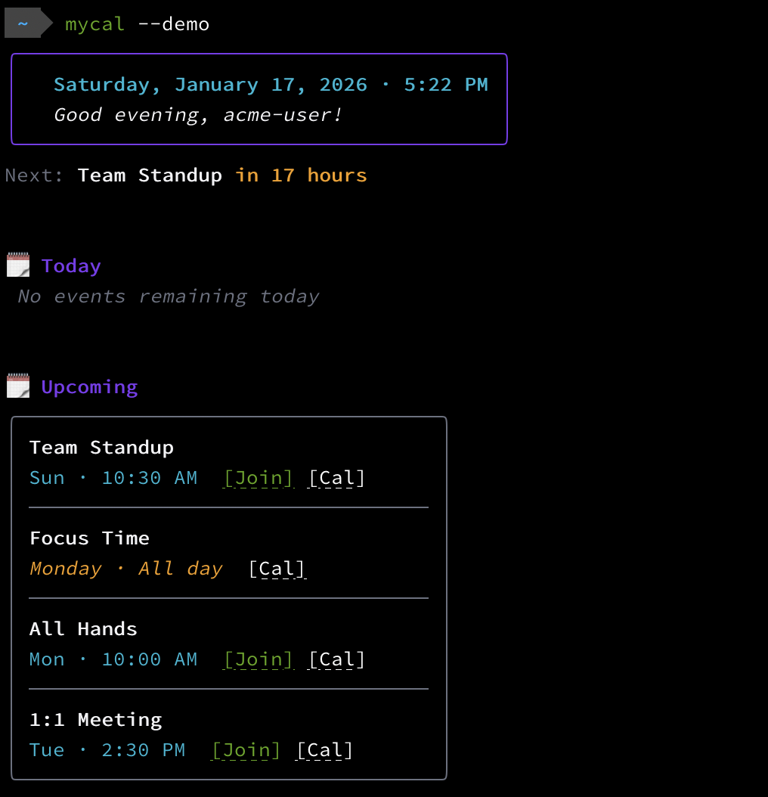

# myCal

A modern, terminal-based Google Calendar client with a beautiful TUI.



## Features

- **Clean UI** - Modern terminal interface with styled event cards and visual hierarchy
- **Interactive Mode** - Navigate events with keyboard, press Enter to join meetings
- **Next Meeting Countdown** - Always know when your next meeting starts
- **Multiple Themes** - Choose from 6 built-in color schemes
- **Smart Links** - Clickable hyperlinks in supported terminals, fallback URLs otherwise
- **Auto-refresh** - Watch mode updates every 5 minutes

## Installation

### Prerequisites

- [Go](https://go.dev/doc/install) 1.19 or later
- Google Calendar API credentials ([setup guide](https://developers.google.com/calendar/api/quickstart/go#set_up_your_environment))

### Quick Start

```bash
# Clone the repository
git clone https://github.com/oredavids/myCal.git
cd myCal

# Build and install
go install

# Run
myCal
```

### Configuration

1. Obtain Google Calendar API credentials following the [official guide](https://developers.google.com/calendar/api/quickstart/go#set_up_your_environment)

2. Save your credentials as `myCalAppCredentials.json`

3. Create a `.env` file (or copy from `.env.sample`):

```bash
MYCAL_CREDENTIALS_DIRECTORY=/path/to/credentials/directory
```

> **Note:** This directory stores both your credentials and the generated OAuth token. If not set, the current working directory is used.

## Usage

```bash
# Basic usage - show today's events and upcoming
myCal

# Interactive watch mode
myCal --watch
myCal -w

# Use a different theme
myCal --theme dracula

# Demo mode (for screenshots)
myCal --demo
```

### Keyboard Shortcuts (Watch Mode)

| Key | Action |
|-----|--------|
| `↑` / `k` | Move up |
| `↓` / `j` | Move down |
| `Enter` | Open meeting link |
| `r` | Refresh |
| `q` | Quit |

### Themes

```bash
myCal --theme <name>
```

Available themes:
- `default` - Purple and cyan
- `catppuccin` - Soft pastels
- `dracula` - Classic dark theme
- `nord` - Cool blues
- `tokyonight` - Deep purples
- `gruvbox` - Warm earth tones

## Project Structure

```
myCal/
├── main.go                 # Entry point
├── internal/
│   ├── auth/               # OAuth authentication
│   ├── calendar/           # Google Calendar API wrapper
│   ├── config/             # Environment configuration
│   └── tui/                # Terminal UI components
│       ├── model.go        # Bubbletea model (interactive mode)
│       ├── render.go       # View rendering
│       ├── styles.go       # Lipgloss styles
│       └── themes.go       # Color themes
└── assets/                 # Screenshots and images
```

## Terminal Compatibility

myCal works in all terminals. Features vary by terminal capabilities:

| Terminal | Clickable Links | Full Color |
|----------|-----------------|------------|
| iTerm2   | Yes | Yes |
| Wezterm  | Yes | Yes |
| Kitty    | Yes | Yes |
| macOS Terminal | No | Yes |
| VS Code  | No | Yes |

Terminals without hyperlink support show meeting URLs directly for easy copy/paste.
