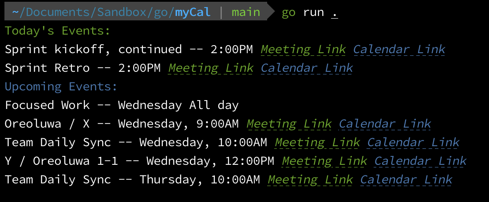

# myCal

Google Calendar CLI app extending the Go quickstart for Google calendar.



## Prerequisite

- Go `v1.19`

## Setup

1. Clone this repository
1. Follow the environment instructions [here](https://developers.google.com/calendar/api/quickstart/go#set_up_your_environment) to obtain the API credentials required.
1. Rename `.env.sample` as `.env` and replace the value of `MYCAL_GOOGLE_CALENDAR_CREDENTIALS_FILE_PATH` with the path to your generated credentials file.

## Run

```cli
go run .
```

### Run Automatically on Shell startup

1. Build the app

    ```cli
    go build
    ```

1. Confirm the directory where the go app will be installed

    ```cli
    go list -f '{{.Target}}' // Example output: /Users/oredavids/go/bin/myCal
    ```

1. Install the app

    ```cli
    go install
    ```

1. Update your shell config file (e.g bashrc, .zshrc, etc)

    ```cli
    export PATH=$PATH:/Users/oredavids/go // Add directory, confirmed earlier, to your PATH variable
    export MYCAL_GOOGLE_CALENDAR_CREDENTIALS_FILE_PATH=/path/to/credentials.json // Where installed app can find your API credentials
    myCal
    ```

    Now that the app has been installed and configured you can also run the executable anywhere, manually with:

    ```cli
    myCal
    ```
